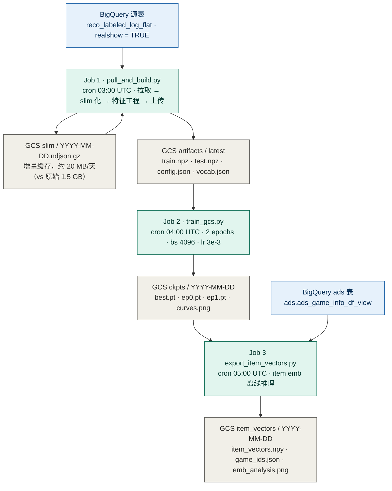
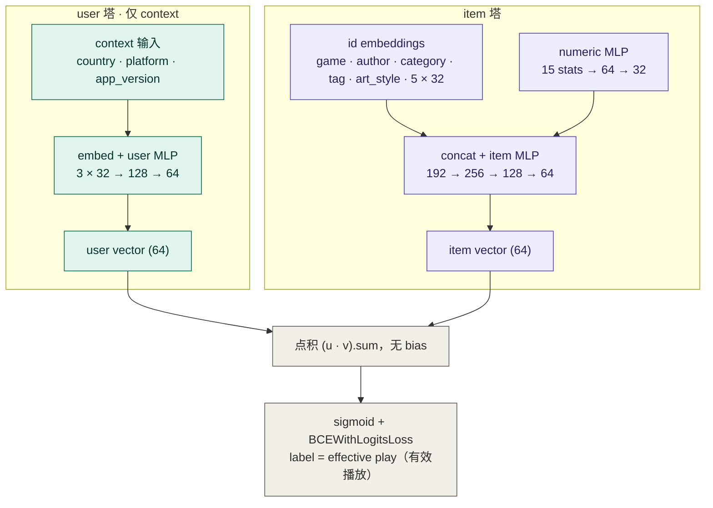

# TwoTowerLite — 粗排推荐模型云端训练

每日三步定时任务，自动完成数据拉取到 item 向量导出的全流程。

```
BigQuery (reco_labeled_log_flat)
  └─[pull_and_build.py 03:00 UTC]─→ GCS two_tower_lite/
                                          └─[train_gcs.py 04:00 UTC]─→ GCS ckpts/
                                                                              └─[export_item_vectors.py 05:00 UTC]─→ GCS item_vectors/
```

---

## 架构图

### 训练架构（每日三步定时任务）

三个 Kubernetes CronJob 通过 GCS 解耦：特征任务 03:00 UTC（北京 11:00）→ 训练任务 04:00 UTC（北京 12:00）→ item 向量导出 05:00 UTC（北京 13:00）。`concurrencyPolicy: Forbid` 保证不重叠。



**Job 1 详细流程：**

1. **Slim 化（增量）**：检查 GCS `slim/{day}.ndjson.gz` 是否存在；缺失的天从 BQ 拉取，提取 27 个字段压缩成 gzip ndjson（~20 MB/天）并上传。已有文件直接复用。
2. **下载 slim 文件**：14 天 slim 文件全部下载到临时目录（~280 MB 总量）。
3. **pass 1 — 建词表**：仅遍历 train 天，统计 token 频率（`MIN_FREQ=1`）；同时计算数值特征均值/标准差。
4. **pass 2 — 编码**：分别遍历 train / test 天，写 `train.npz` / `test.npz`；test 未见 token 标记为 OOV（索引 1）。
5. **上传 artifacts**：写入 `artifacts/latest/`。

> **训练/测试划分**：`test = today - 1`，`train = [today-14, today-2]`（共 13 天）。

> **泄漏字段**：`position` / `final_score` / `predicted_scores` / `pipeline` / `reason_list` 均被显式剔除。

### 模型结构（TwoTowerLite，约 0.64M 参数）

context-only 双塔：user 塔仅用 context 特征（无 user_id、无行为序列），item 塔用 id 类目 + 15 维数值统计；点积出 logit，CosineAnnealingLR + BCE 训练。best ckpt 按 test GAUC 选取。



**15 维数值特征**（signed log1p 标准化）：
- game stats（7）：play_cnt / show_cnt / like_cnt / comment_cnt / remix_cnt / share_cnt / game_version_cnt
- author stats（8）：fans_cnt / following_cnt / play_cnt / like_cnt / publish_games / comment_cnt / remix_cnt / share_cnt

---

## 项目结构

```
.
├── pull_and_build.py           # Job 1: BQ 增量拉取 → slim 化 → 特征工程 → 上传 GCS
├── train_gcs.py                # Job 2: 下载特征 + 训练 + 上传 ckpt
├── export_item_vectors.py      # Job 3: 离线计算所有游戏 item embedding → 上传 GCS
├── model/
│   ├── two_tower_lite.py       # 模型定义（user context × item 双塔，点积）
│   └── metrics.py              # auc / gauc
├── pipeline/
│   └── build_features.py       # 特征工程（slim ndjson.gz → npz + config + vocab）
├── Dockerfile                  # CPU-only torch，三个 Job 共用同一镜像
├── cronjob_features.yaml       # Job 1 CronJob（03:00 UTC = 北京 11:00）
├── cronjob.yaml                # Job 2 CronJob（04:00 UTC = 北京 12:00）
├── cronjob_export_items.yaml   # Job 3 CronJob（05:00 UTC = 北京 13:00）
├── job_export_items.yaml       # Job 3 临时 Job yaml（手动触发用）
├── deploy.sh                   # Cloud Build 编译 + push + kubectl apply
└── requirements.txt            # Python 依赖（不含 torch，Dockerfile 单独装）
```

---

## GCS 目录结构

```
gs://rezona-ml/
└── two_tower_lite/
    ├── slim/                            # per-day slim ndjson.gz（增量缓存）
    │   └── YYYY-MM-DD.ndjson.gz        # ~20 MB/天
    ├── artifacts/
    │   └── latest/                     # Job 1 每天覆盖写
    │       ├── train.npz
    │       ├── test.npz
    │       ├── config.json
    │       └── vocab.json
    ├── ckpts/
    │   └── YYYY-MM-DD/                 # Job 2 按日期写入
    │       ├── two_tower_lite_best.pt  # best-by-GAUC checkpoint
    │       ├── two_tower_lite.pt       # 最终 epoch checkpoint
    │       ├── two_tower_lite_ep0.pt   # epoch 0 结束时 checkpoint
    │       ├── two_tower_lite_ep1.pt   # epoch 1 结束时 checkpoint
    │       ├── curves.csv              # 训练曲线数值
    │       └── curves.png              # 训练曲线图（AUC / GAUC）
    └── item_vectors/
        └── YYYY-MM-DD/                 # Job 3 按日期写入
            ├── item_vectors.npy        # float32 (N, 64)，N 为当天 published 游戏数
            ├── game_ids.json           # N 个 game_id（与 item_vectors 行序一致）
            └── emb_analysis.png        # embedding 分布可视化（norm / PCA / cosine sim）
```

---

## 基础设施

| 资源 | 状态 | 说明 |
|---|---|---|
| `gs://rezona-ml` | ✅ 已创建 | us-east1，与 GKE 集群同区，流量免费 |
| K8s ServiceAccount `recoleaf` | ✅ 复用 | production namespace |
| `recoleaf-kafka-writer` → GCS | ✅ objectAdmin | 可读写 `gs://rezona-ml` |
| `recoleaf-kafka-writer` → BQ | ✅ dataViewer + jobUser | 可查询源表及 ads 表 |
| Artifact Registry `reco-model` | ✅ 已创建 | `us-east1-docker.pkg.dev/rezonaai/reco-model/` |

---

## 首次部署

### 1. 编译镜像

```bash
gcloud builds submit \
  --tag us-east1-docker.pkg.dev/rezonaai/reco-model/ml-trainer:latest \
  --machine-type=e2-highcpu-8 \
  .
```

### 2. 部署三个 CronJob

```bash
kubectl apply -f cronjob_features.yaml
kubectl apply -f cronjob.yaml
kubectl apply -f cronjob_export_items.yaml
```

---

## 日常操作

### 手动触发 Job（从 CronJob 派生）

```bash
# Job 1: 特征
kubectl create job --from=cronjob/two-tower-lite-features features-$(date +%m%d) -n production

# Job 2: 训练
kubectl create job --from=cronjob/two-tower-lite-train train-$(date +%m%d) -n production

# Job 3: item 向量导出
kubectl create job --from=cronjob/two-tower-lite-export-items export-$(date +%m%d) -n production
```

查看日志：

```bash
kubectl logs -f job/<job-name> -n production
```

### 手动触发 item 向量导出（独立 Job yaml）

```bash
kubectl apply -f job_export_items.yaml
kubectl logs -f job/export-item-vectors -n production
kubectl delete job export-item-vectors -n production
```

### 查看 CronJob 状态

```bash
kubectl get cronjob -n production
kubectl get jobs -n production --sort-by=.metadata.creationTimestamp
```

### 查看 / 下载最新产物

```bash
# ckpt
LATEST=$(gsutil ls gs://rezona-ml/two_tower_lite/ckpts/ | sort | tail -1)
gsutil cp ${LATEST}two_tower_lite_best.pt ./
gsutil cp ${LATEST}curves.png ./

# item vectors
LATEST_VEC=$(gsutil ls gs://rezona-ml/two_tower_lite/item_vectors/ | sort | tail -1)
gsutil cp ${LATEST_VEC}item_vectors.npy ./
gsutil cp ${LATEST_VEC}game_ids.json ./
gsutil cp ${LATEST_VEC}emb_analysis.png ./
```

---

## 环境变量

### Job 1 — `pull_and_build.py`

| 变量 | 默认值 | 说明 |
|---|---|---|
| `GCS_BUCKET` | **必填** | GCS bucket 名称 |
| `GCS_ARTIFACTS_PREFIX` | **必填** | artifacts 上传前缀 |
| `GCS_SLIM_PREFIX` | `two_tower_lite/slim` | per-day slim ndjson.gz 缓存前缀 |
| `BQ_PROJECT` | `rezonaai` | GCP 项目 |
| `BQ_TABLE` | `rezonaai.datalake.reco_labeled_log_flat` | BQ 表 |
| `BQ_WHERE` | `context_info.realshow = TRUE` | 额外过滤条件 |
| `BQ_LIMIT` | `0`（不限）| 每天最大行数，调试用 |
| `TRAIN_DAYS` | 自动（today-14 到 today-2）| 逗号分隔日期，覆盖自动推算 |
| `TEST_DAYS` | 自动（today-1）| 逗号分隔日期，覆盖自动推算 |

### Job 2 — `train_gcs.py`

| 变量 | 默认值 | 说明 |
|---|---|---|
| `GCS_BUCKET` | **必填** | GCS bucket 名称 |
| `GCS_ARTIFACTS_PREFIX` | **必填** | artifacts 下载前缀 |
| `GCS_CKPT_PREFIX` | **必填** | ckpt 上传前缀 |
| `EPOCHS` | `2` | 训练轮数 |
| `BS` | `4096` | batch size |
| `LR` | `3e-3` | 初始学习率（CosineAnnealingLR，eta_min=0）|
| `EVAL_EVERY` | `50` | 每隔多少 step 评估一次 |

### Job 3 — `export_item_vectors.py`

| 变量 | 默认值 | 说明 |
|---|---|---|
| `GCS_BUCKET` | **必填** | GCS bucket 名称 |
| `GCS_ARTIFACTS_PREFIX` | **必填** | config/vocab 读取前缀 |
| `GCS_CKPT_PREFIX` | **必填** | ckpt 读取前缀（自动取最新日期）|
| `GCS_ITEM_VECTORS_PREFIX` | `two_tower_lite/item_vectors` | 输出前缀 |
| `BQ_PROJECT` | `rezonaai` | GCP 项目 |
| `BQ_TABLE` | `rezonaai.ads.ads_game_info_df_view` | 游戏信息表 |

### build_features.py 内部参数

| 参数 | 值 | 说明 |
|---|---|---|
| `MIN_FREQ` | `1` | token 最低出现次数（所有出现过的 token 均入词表）|
| `PAD` | `0` | padding 索引 |
| `OOV` | `1` | unknown token 索引 |

---

## 资源规格

| Job | CPU | Memory | 临时磁盘 | 预计耗时 |
|---|---|---|---|---|
| Job 1（特征）| 2–4 核 | 8–16 Gi | 10 Gi | ~15–20 分钟 |
| Job 2（训练）| 4–8 核 | 32 Gi | 默认 | ~40–70 分钟（CPU）|
| Job 3（导出）| 2–4 核 | 4–8 Gi | 默认 | ~15–20 分钟（含 BQ 拉取 + 推理）|
