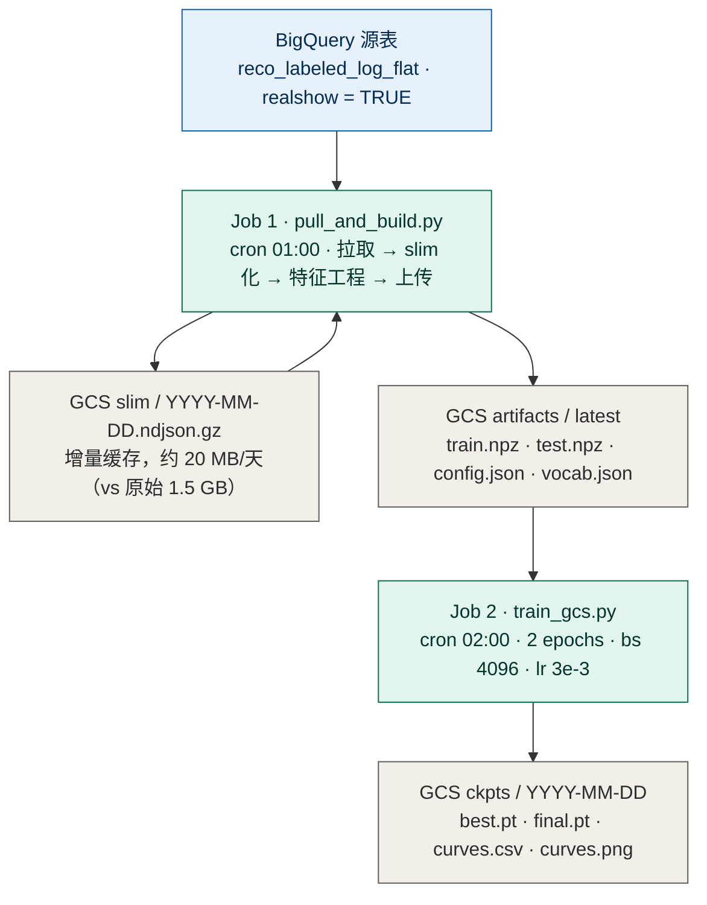

# TwoTowerLite — 粗排推荐模型云端训练

每日两步定时任务，自动完成数据拉取到模型更新的全流程。

```
BigQuery (reco_labeled_log_flat)
  └─[pull_and_build.py 01:00 UTC]─→ GCS two_tower_lite/
                                          └─[train_gcs.py 02:00 UTC]─→ GCS ckpts/
```

---

## 架构图

### 训练架构（每日两步定时任务）

两个 Kubernetes CronJob 通过 GCS 解耦：特征任务 03:00 UTC（北京时间 11:00）从 BigQuery 拉并写 slim artifacts，训练任务 04:00 UTC（北京时间 12:00）读取 artifacts 训练并写 ckpt。`concurrencyPolicy: Forbid` 保证不重叠，两个 Job 只通过 `gs://rezona-ml/two_tower_lite/` 通信。



**Job 1 详细流程：**

1. **Slim 化（增量）**：检查 GCS `slim/{day}.ndjson.gz` 是否存在；缺失的天从 BQ 拉取，边拉边提取 27 个字段压缩成 gzip ndjson（~20 MB/天），上传后删除本地文件。已有 slim 文件直接复用，不再查 BQ。
2. **下载 slim 文件**：14 天 slim 文件全部下载到本地临时目录（~280 MB 总量）。
3. **pass 1 — 建词表**：仅遍历 train 天，统计各 categorical 特征的 token 频率，保留 `MIN_FREQ ≥ 5` 的 token；同时计算数值特征的均值/标准差用于归一化。
4. **pass 2 — 编码**：分别遍历 train / test 天，写 `train.npz` / `test.npz`；test 中未见 token 标记为 OOV（索引 1）。
5. **上传 artifacts**：`train.npz` / `test.npz` / `config.json` / `vocab.json` 写入 `artifacts/latest/`。

> **训练集/测试集划分**：以 `datetime.date.today()` 为基准——昨天为 test（1 天），前 13 天为 train，无重叠。

> **泄漏字段**：`position` / `final_score` / `predicted_scores` / `pipeline` / `reason_list` / `context_info` 均被显式剔除。

### 模型结构（TwoTowerLite，约 5.14M 参数）

context-only 双塔：user 塔仅用 context 特征（无 user_id、无行为序列），item 塔用 id 类目 + 16 维数值统计；点积出 logit，BCE 训练。best ckpt 按 test GAUC 选取（非最终 epoch）。


**16 维数值特征**（signed log1p 标准化）：
- game stats（7）：play_cnt / show_cnt / like_cnt / comment_cnt / remix_cnt / share_cnt / game_version_cnt
- author stats（8）：fans_cnt / following_cnt / play_cnt / like_cnt / publish_games / comment_cnt / remix_cnt / share_cnt
- game_age_days（1）：`(server_ts_ms - create_ts_ms) / 86400000`

---

## 项目结构

```
.
├── pull_and_build.py        # Job 1: BQ 增量拉取 → slim 化 → 特征工程 → 上传 GCS
├── train_gcs.py             # Job 2: 下载特征 + 训练 + 上传 ckpt
├── model/
│   ├── two_tower_lite.py    # 模型定义（user context × item 双塔，点积）
│   └── metrics.py           # auc / gauc
├── pipeline/
│   └── build_features.py    # 特征工程（slim ndjson.gz → npz + config + vocab）
├── Dockerfile               # CPU-only torch，两个 Job 共用同一镜像
├── cronjob_features.yaml    # Job 1 CronJob（01:00 UTC）
├── cronjob.yaml             # Job 2 CronJob（02:00 UTC）
├── deploy.sh                # Cloud Build 编译 + push + kubectl apply
└── requirements.txt         # Python 依赖（不含 torch，Dockerfile 单独装）
```

---

## GCS 目录结构

```
gs://rezona-ml/                          # bucket，us-east1，与 GKE 集群同区
└── two_tower_lite/
    ├── slim/                            # per-day slim ndjson.gz（增量，历史永久保留）
    │   ├── 2026-06-22.ndjson.gz        # ~20 MB/天（vs 原始 ~1.5 GB）
    │   └── 2026-07-05.ndjson.gz
    ├── raw/                             # 仅迁移用：旧格式原始 ndjson，首次运行自动 slim 化
    │   └── 2026-07-03.ndjson
    ├── artifacts/
    │   └── latest/                     # Job 1 每天覆盖写
    │       ├── train.npz
    │       ├── test.npz
    │       ├── config.json
    │       └── vocab.json
    └── ckpts/
        └── YYYY-MM-DD/                 # Job 2 按日期写入
            ├── two_tower_lite_best.pt  # best-by-GAUC checkpoint
            ├── two_tower_lite.pt       # 最终 epoch checkpoint
            ├── curves.csv             # 训练曲线数值
            └── curves.png             # 训练曲线图（AUC / GAUC）
```

---

## 基础设施（已完成）

| 资源 | 状态 | 说明 |
|---|---|---|
| `gs://rezona-ml` | ✅ 已创建 | us-east1，与 GKE 集群同区，流量免费 |
| K8s ServiceAccount `recoleaf` | ✅ 复用 | production namespace，绑定 `recoleaf-kafka-writer` GSA |
| `recoleaf-kafka-writer` → GCS | ✅ objectAdmin | 可读写 `gs://rezona-ml` |
| `recoleaf-kafka-writer` → BQ | ✅ dataViewer + jobUser | 可查询 `reco_labeled_log_flat` |
| `recoleaf-kafka-writer` → datalake GCS | ✅ objectViewer | BQ 外部表所依赖的底层 GCS bucket |
| Artifact Registry `reco-model` | ✅ 已创建 | `us-east1-docker.pkg.dev/rezonaai/reco-model/` |

---

## 首次部署

### 1. 编译镜像（使用 Cloud Build，避免本地磁盘不足）

```bash
gcloud builds submit \
  --tag us-east1-docker.pkg.dev/rezonaai/reco-model/ml-trainer:latest \
  --machine-type=e2-highcpu-8 \
  .
```

### 2. 部署 CronJob

```bash
kubectl apply -f cronjob_features.yaml
kubectl apply -f cronjob.yaml
```

---

## 日常操作

### 临时 Job（不依赖 CronJob，直接运行）

不需要先 apply CronJob，直接创建一次性 Job：

```bash
cat <<'EOF' | kubectl apply -f -
apiVersion: batch/v1
kind: Job
metadata:
  name: features-run-now
  namespace: production
spec:
  backoffLimit: 0
  template:
    spec:
      restartPolicy: Never
      serviceAccountName: recoleaf
      containers:
      - name: features
        image: us-east1-docker.pkg.dev/rezonaai/reco-model/ml-trainer:latest
        imagePullPolicy: Always
        command: ["python", "/app/pull_and_build.py"]
        env:
        - name: GCS_BUCKET
          value: "rezona-ml"
        - name: GCS_ARTIFACTS_PREFIX
          value: "two_tower_lite/artifacts"
        - name: GCS_SLIM_PREFIX
          value: "two_tower_lite/slim"
        - name: BQ_PROJECT
          value: "rezonaai"
        - name: BQ_TABLE
          value: "rezonaai.datalake.reco_labeled_log_flat"
        - name: BQ_WHERE
          value: "context_info.realshow = TRUE"
        resources:
          requests:
            cpu: "2"
            memory: "8Gi"
            ephemeral-storage: "10Gi"
          limits:
            cpu: "4"
            memory: "16Gi"
            ephemeral-storage: "10Gi"
EOF
```

查看进度：

```bash
kubectl get pod -n production -l job-name=features-run-now
kubectl logs -f -n production -l job-name=features-run-now
```

清理：

```bash
kubectl delete job features-run-now -n production
```

### 临时训练 Job

```bash
cat <<'EOF' | kubectl apply -f -
apiVersion: batch/v1
kind: Job
metadata:
  name: train-run-now
  namespace: production
spec:
  backoffLimit: 0
  template:
    spec:
      restartPolicy: Never
      serviceAccountName: recoleaf
      containers:
      - name: trainer
        image: us-east1-docker.pkg.dev/rezonaai/reco-model/ml-trainer:latest
        imagePullPolicy: Always
        command: ["python", "/app/train_gcs.py"]
        env:
        - name: GCS_BUCKET
          value: "rezona-ml"
        - name: GCS_ARTIFACTS_PREFIX
          value: "two_tower_lite/artifacts"
        - name: GCS_CKPT_PREFIX
          value: "two_tower_lite/ckpts"
        - name: EPOCHS
          value: "2"
        - name: BS
          value: "4096"
        - name: LR
          value: "3e-3"
        - name: EVAL_EVERY
          value: "50"
        resources:
          requests:
            cpu: "4"
            memory: "32Gi"
          limits:
            cpu: "8"
            memory: "32Gi"
EOF
```

查看进度：

```bash
kubectl get pod -n production -l job-name=train-run-now
kubectl logs -f -n production -l job-name=train-run-now
```

清理：

```bash
kubectl delete job train-run-now -n production
```

### 手动触发 Job 1（需 CronJob 已 apply）

```bash
kubectl create job --from=cronjob/two-tower-lite-features \
  features-$(date +%m%d) -n production
kubectl logs -f job/features-$(date +%m%d) -n production
```

### 手动触发 Job 2（需 CronJob 已 apply）

```bash
kubectl create job --from=cronjob/two-tower-lite-train \
  train-$(date +%m%d) -n production
kubectl logs -f job/train-$(date +%m%d) -n production
```

### 查看 CronJob 状态

```bash
kubectl get cronjob -n production
kubectl get jobs -n production
```

### 查看 / 下载最新 ckpt

```bash
# 列出所有日期
gsutil ls gs://rezona-ml/two_tower_lite/ckpts/

# 下载最新 best checkpoint 和训练曲线图
LATEST=$(gsutil ls gs://rezona-ml/two_tower_lite/ckpts/ | sort | tail -1)
gsutil cp ${LATEST}two_tower_lite_best.pt ./
gsutil cp ${LATEST}curves.png ./
```

---

## 环境变量

### Job 1 — `pull_and_build.py`

| 变量 | 默认值 | 说明 |
|---|---|---|
| `GCS_BUCKET` | **必填** | GCS bucket 名称 |
| `GCS_ARTIFACTS_PREFIX` | **必填** | artifacts 上传前缀 |
| `GCS_SLIM_PREFIX` | `two_tower_lite/slim` | per-day slim ndjson.gz 缓存前缀 |
| `GCS_RAW_PREFIX` | `two_tower_lite/raw` | 迁移用：旧格式 raw ndjson 路径，首次自动 slim 化 |
| `BQ_PROJECT` | `rezonaai` | GCP 项目 |
| `BQ_TABLE` | `rezonaai.datalake.reco_labeled_log_flat` | BQ 表 |
| `BQ_WHERE` | `context_info.realshow = TRUE` | 额外过滤条件 |
| `BQ_LIMIT` | `0`（不限）| 每天最大行数，调试用 |
| `BQ_TIMEOUT_SEC` | `1800` | BQ 查询超时（秒）|
| `TRAIN_DAYS` | 自动（today-14 到 today-2）| 逗号分隔日期，覆盖自动推算 |
| `TEST_DAYS` | 自动（today-1）| 逗号分隔日期，覆盖自动推算 |

**日期窗口自动推算**：以 `datetime.date.today()` 为基准，`test = today - 1`，`train = [today-14, today-2]`（共 13 天，无重叠）。

### Job 2 — `train_gcs.py`

| 变量 | 默认值 | 说明 |
|---|---|---|
| `GCS_BUCKET` | **必填** | GCS bucket 名称 |
| `GCS_ARTIFACTS_PREFIX` | **必填** | artifacts 下载前缀 |
| `GCS_CKPT_PREFIX` | **必填** | ckpt 上传前缀 |
| `EPOCHS` | `2` | 训练轮数 |
| `BS` | `4096` | batch size |
| `LR` | `3e-3` | 学习率 |
| `EVAL_EVERY` | `50` | 每隔多少 step 评估一次 |

### build_features.py 内部参数

| 参数 | 值 | 说明 |
|---|---|---|
| `MIN_FREQ` | `1` | token 最低出现次数，低于阈值归 OOV（所有出现过的 token 均入词表）|
| `PAD` | `0` | padding 索引 |
| `OOV` | `1` | unknown / 低频 token 索引 |

---

## 资源规格

| Job | CPU | Memory | 临时磁盘 | 预计耗时 |
|---|---|---|---|---|
| Job 1（特征）| 2–4 核 | 8 Gi | 10 Gi（必须）| ~20–40 分钟（BQ 拉取 + slim 编码 + 特征工程）|
| Job 2（训练）| 4–8 核 | 32 Gi | 默认 | ~30–60 分钟（CPU，13 天数据）|

**Job 1 磁盘说明**：slim 文件 ~20 MB/天，14 天约 280 MB；BQ 拉取时边写边上传，本地峰值 < 100 MB；build 阶段下载全部 slim 文件（~280 MB），合计远低于 10 Gi 上限。`ephemeral-storage: 10Gi` 为 GKE Autopilot 最大值，必须显式声明（默认 1 Gi 会被 evict）。

**Job 1 内存说明**：特征矩阵峰值约 0.8 GB（13 天 × ~300k 行），8 Gi 充裕。

**Job 2 内存说明**：训练数据全量载入 torch 约 7 GB，加运行时开销共需 ~12 GB，32 Gi 有足够余量。

**GPU 加速**：取消 `cronjob.yaml` 中注释的 GPU 段，Job 2 可降至几分钟。
